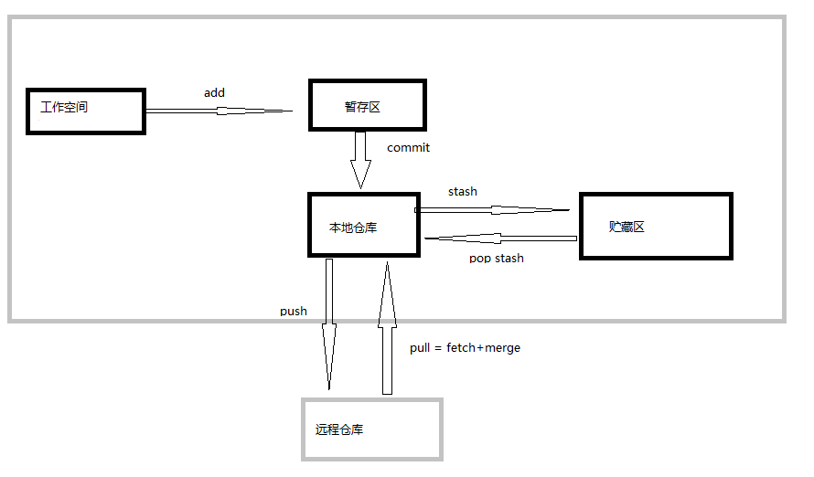

Git安装、配置、使用、常见问题汇总


## git介绍


## 1.windows环境下载、安装
https://git-scm.com/download

## 2.linux安装git
```
$sudo apt-get install git
$git --version
```

## 3.Git Bash使用
``` 
git pull出错回滚
    1.git log 查看要回滚的版本
    2.git reset --hard "commit Id"
git clone -b dev http://gitlab.xxx.com/root/xxx.git  //克隆Dev分支代码
git checkout -b dev //切换dev分支，同时本地分支新增检出dev分支
git checkout -b v0.9 origin/v0.9 //拉取远端 origin/v0.9，本地新增v0.9 ，并切换至v0.9
git log //查看提交记录
git branch //查看本地分支
git branch -a  //查看所有的分支
git branch -r  //查看远程所有分支
git pull //拉取远程代码并合并
git fetch  //相当于是从远程获取最新版本到本地，不会自动merge
git status //查看当前状态
git checkout . //本地所有修改的。没有的提交的，都返回到原来的状态，‘.’前面有空格
git add .  //添加所有改动文件
git commit -a -m"commit message"  //提交到本地
git push  //将本地分支推送到服务器上去。
```


## 4.tortoiseGit安装使用


## 5.常见问题解决方案


